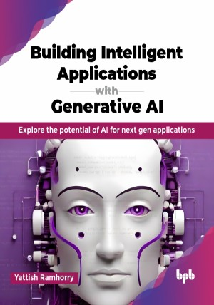

# Building Intelligent Applications with Generative AI

Explore the potential of AI for next gen applications.

This is the repository for [Building Intelligent Applications with Generative AI
](https://bpbonline.com/products/building-intelligent-applications-with-generative-ai?variant=44049605820616),published by BPB Publications.

## About the Book
Building Intelligent Applications with Generative AI is a comprehensive guide that unlocks the power of generative AI for building cutting-edge applications. This book covers a wide range of use cases and practical examples, from text generation and conversational agents to creative media generation and code completion. These examples are designed to help you capitalize on the potential of generative AI in your applications.

Through clear explanations, step-by-step tutorials, and real-world case studies, you will learn how to prepare data and train generative AI models. You will also explore different generative AI techniques, including large language models like GPT-4, ChatGPT, Llama 2, and Google’s Gemini, to understand how they can be applied in various domains, such as content generation, virtual assistants, and code generation. With a focus on practical implementation, this book also examines ethical considerations, best practices, and future trends in generative AI. 

Further, this book concludes by exploring ethical considerations and best practices for building responsible GAI applications, ensuring you are harnessing this technology for good. By the end of this book, you will be well-equipped to leverage the power of GAI to build intelligent applications and unleash your creativity in innovative ways.

## What You Will Learn
• Understand generative AI (GAI) and large language models (LLMs).

• Explore real-world GAI applications across industries.

• Build intelligent applications with the ChatGPT API.

• Explore retrieval augmented generation with LangChain and Gemini Pro.

• Create chatbots with LangChain and Streamlit for data retrieval.
